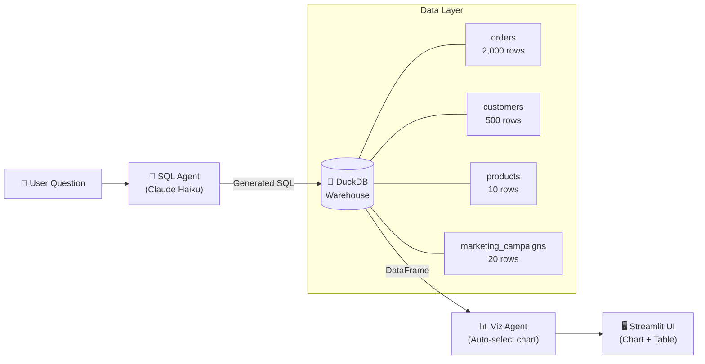

# 🤖 Text-to-SQL Auto-Viz Analytics Agent

> Ask business questions in plain English. Get production-quality SQL + the right chart — automatically.


---

## 📌 What It Does

A self-service analytics agent where non-technical users type questions like:

> *"Which 5 products generated the most revenue last quarter?"*
> *"Show monthly revenue trend for 2024"*
> *"Which marketing channel has the highest conversion rate?"*

…and instantly get:
- ✅ A generated, validated SQL query
- ✅ The best Plotly chart for the data (line, bar, scatter, histogram)
- ✅ A raw data table to explore

No SQL knowledge required. No waiting for a data team.

---

## 🏗️ Architecture



**Flow:**
1. User types a business question into the Streamlit chat interface
2. `sql_agent.py` sends the question + full schema context to Claude Haiku
3. Claude returns a safe, optimised DuckDB SQL query
4. The query is executed against the local DuckDB warehouse
5. `viz_agent.py` inspects the result DataFrame and picks the right chart type
6. The chart, SQL, and raw table are rendered in the UI

---

## 🗂️ Repo Structure

```
text-to-sql-agent/
├── app.py                  # Streamlit chat UI (entry point)
├── requirements.txt
├── .env.example
├── agents/
│   ├── sql_agent.py        # Claude-powered Text-to-SQL generator
│   └── viz_agent.py        # Auto chart selection (Plotly)
└── data/
    └── setup_db.py         # DuckDB schema + synthetic data seeder
```

---

## ⚡ Quick Start

### 1. Clone & install

```bash
git clone https://github.com/imtheeon/text-to-sql-agent.git
cd text-to-sql-agent
pip install -r requirements.txt
```

### 2. Set your API key

```bash
cp .env.example .env
# Edit .env and add your Anthropic API key:
# ANTHROPIC_API_KEY=sk-ant-...
```

Get a key at [console.anthropic.com](https://console.anthropic.com/).

### 3. Run the app

```bash
streamlit run app.py
```

The database is seeded automatically on first launch.

---

## 💡 Example Questions to Try

| Category | Question |
|---|---|
| Revenue | `Show monthly revenue trend for 2024` |
| Products | `Which 5 products generated the most revenue?` |
| Customers | `What percentage of customers have churned by tier?` |
| Marketing | `Which marketing channel has the highest conversion rate?` |
| Regional | `Show total orders and revenue by region` |
| Profitability | `Compare profit margin across product categories` |
| Campaigns | `Which campaigns had the best ROI?` |

---

## 🧠 How Chart Selection Works

The `viz_agent.py` uses pure heuristics (no extra API call):

| Data Shape | Chart Type |
|---|---|
| Date column + numeric | 📈 Line chart (time series) |
| Two numeric columns | 🔵 Scatter plot |
| Categorical + numeric | 📊 Bar chart (horizontal if >8 categories) |
| Single numeric column | 📉 Histogram |

---

## 🛠️ Tech Stack

| Tool | Role |
|---|---|
| **Python 3.11+** | Core language |
| **Anthropic Claude Haiku** | Natural language → SQL |
| **DuckDB** | Local analytics warehouse |
| **Pandas** | DataFrame processing |
| **Plotly Express** | Interactive visualisations |
| **Streamlit** | Web UI |
| **python-dotenv** | Environment management |

---

## 🔒 Security

- All SQL is generated with a system prompt that **blocks DDL and DML** (no DROP, DELETE, INSERT, UPDATE)
- DuckDB runs in **read-only mode** during query execution
- The API key is stored in `.env` and never committed (`.gitignore` protected)

---

## 📄 License

MIT — free to use, modify, and distribute.

---

*Built by [Leanthel Colon Cuevas](https://linkedin.com/in/leanthel-colon-cuevas-5241a1319) · [Portfolio](https://imtheeon.github.io/data-analytics-portfolio)*
